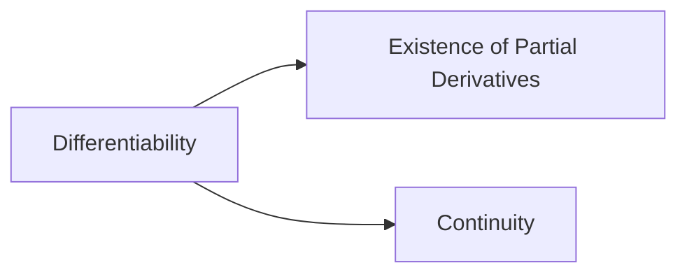

# 12.5 Total Differentiation

Total differentiation is a concept in multivariable calculus that deals with the differentiation of functions with multiple variables. It allows us to find the total rate of change of a function with respect to all its variables. In other words, it enables us to determine how a function changes when all of its independent variables change simultaneously.

## Partial Derivatives

Before diving into total differentiation, let's review the concept of partial derivatives. In multivariable calculus, when we have a function with multiple variables, we can take partial derivatives to measure how the function changes with respect to each individual variable, holding all other variables constant.

For a function with two variables, say $f(x,y)$, the partial derivative with respect to $x$ is denoted as $\frac{\part f}{\part x}$, and it measures the instantaneous rate of change of $f$ with respect to $x$ while keeping $y$ constant. Similarly, the partial derivative with respect to $y$, denoted as $\frac{\part f}{\part y}$, measures the rate of change of $f$ with respect to $y$ while keeping $x$ constant.

For functions with more than two variables, we extend this concept to partial derivatives with respect to each individual variable.

## Total Differential

The total differential of a function $f(x_1,x_2,\cdots,x_n)$ represents the change in the function caused by infinitesimally small changes in all of its variables. It is denoted as  $df$ or $\delta f$ and can be expressed as follows:
$$
df=\frac{\part}{\part x_1}dx_1+\frac{\part}{\part x_2}dx_2+\cdots+\frac{\part f }{\part x_n}dx_n
$$
Here, $dx_1,dx_2,\cdots,dx_n$ represent the infinitesimal changes in the variables $x_1,x_2,\cdots,x_n$ respectively.

The total differential allows us to approximate the change in a function based on the changes in its variables. It provides a linear approximation to the function near a given point, similar to how the tangent line approximates a curve in single-variable calculus.

## Total Derivative

The total derivative extends the concept of total differentiation to determine the rate of change of a function with respect to its variables. It is often denoted as $Df$ or $\frac{df}{dt}$ and can be defined as follows:
$$
Df=\frac{\part f}{\part x_1}\frac{\part x_1}{dt}+\frac{\part f}{\part x_2}\frac{\part x_2}{dt}+\cdots+\frac{\part f}{\part x_n}\frac{\part x_n}{dt}
$$
Here, $\frac{\part x_1}{dt},\frac{\part x_2}{dt},\cdots,\frac{\part x_n}{dt}$ represent the rates of change of the variables $x_1,x_2,\cdots,x_n $ respectively with respect to an independent variable $t$.

The total derivative allows us to determine how the function changes as its variables change with respect to a different independent variable. It measures the total rate of change, taking into account both the direct effects of the variables' changes and their dependencies on the independent variable.

## Summary

- Partial derivatives measure the instantaneous rate of change of a function with respect to each individual variable, while holding the other variables constant.
- The total differential ($df$) represents the change in a function caused by infinitesimally small changes in all of its variables.
- The total derivative ($Df$) determines the rate of change of a function with respect to its variables, taking into account their dependencies on an independent variable.

## Sufficiency and Necessity Conditions for Differentiability in Multivariable Calculus

In multivariable calculus, 

- The sufficiency condition for differentiability states that the existence and continuity of all partial derivatives are sufficient for differentiability. 

- On the other hand, the necessity condition asserts that differentiability implies continuity.

## Relationship between Differentiability, Partial Derivatives, and Continuity in Multivariable Functions

In multivariable calculus, there exists a close relationship between differentiability, partial derivatives, and continuity of a function with multiple variables. Let's explore the connections between these concepts.

1. Differentiability implies the existence of partial derivatives: If a multivariable function $f(x_1,x_2,\cdots,x_n)$ is differentiable at a point, then all of its partial derivatives with respect to each variable exist at that point.
2. Differentiability implies continuity: If a function is differentiable at a point, it is necessarily continuous at that point. This means that a differentiable function has no abrupt changes or discontinuities at the point of differentiability.
3. Partial derivatives do not necessarily imply differentiability: Although the existence of partial derivatives is a necessary condition for differentiability, it is not a sufficient condition. A function may have well-defined partial derivatives at a point but still fail to be differentiable if the partial derivatives do not satisfy certain additional conditions.
4. Continuity is not sufficient for differentiability: A function may be continuous at a point without being differentiable at that point. Continuity alone does not guarantee the existence of partial derivatives or the differentiability of a function.

In summary, differentiability is a stronger condition than the existence of partial derivatives and continuity. It encompasses both the existence of partial derivatives and the additional property of having a well-defined linear approximation. Continuity is a necessary condition for differentiability, while the existence of partial derivatives is a necessary but not sufficient condition.

## Approximation

Let's explain the mathematical principles and formula for approximating a calculation using the equation $f(x+\Delta x, y+\Delta) \approx f(x,y)+f_x'dx+f_y'dy $, where $f_x'$ and $f_y'$ denote the partial derivatives of $f$ with respect to $x$ and $y$ respectively.

### Mathematical Principles and Formula

Consider a function $f(x,y)$ that is differentiable in a neighborhood of a point $(x,y)$. We want to approximate the value of $f(x+\Delta x, y+\Delta)$, where $\Delta x$ and $\Delta y$ are small increments in the variables $x$ and $y$ respectively.

The idea behind the approximation is to use the first-order Taylor expansion of the function $f$ around the point $(x,y)$. This expansion is derived using the total differential:
$$
df=\frac{\part f}{\part x}\Delta x + \frac{\part f}{\part y}\Delta y
$$
Now, we can rearrange this equation to approximate $f(x+\Delta x, y+\Delta)$ as follows:
$$
f(x+\Delta x, y+\Delta) \approx f(x,y)+\frac{\part f}{\part x}\Delta x + \frac{\part f}{\part y}\Delta y
$$
This formula states that the value of $f$ at the point $(x+\Delta x, y+\Delta)$ can be approximated by the value of $f$ at the point $(x,y)$ plus the partial derivatives of $f$ with respect to $x$ and $y$, multiplied by the corresponding increments $\Delta x$ and $\Delta y$.

### Example

Let's apply this approximation formula to estimate the value of $f(x,y)=x^y$ at $x=1.04$ and $y=2.02$. We will approximate $f(1.04,2.02)$ using the formula $f(x+\Delta x, y+\Delta) \approx f(x,y)+\frac{\part f}{\part x}\Delta x + \frac{\part f}{\part y}\Delta y$, with $\Delta x=0.04$ and $\Delta y = 0.02$.

First, we need to calculate the partial derivatives of $f$ with respect to $x$ and $y$:
$$
\begin{eqnarray}
	\frac{\part f}{\part x}&=&yx^{y-1}\\
	\frac{\part f}{\part y}&=&x^y\ln(x)
\end{eqnarray}
$$
Now, substituting these values and the given increments into the approximation formula, we have:
$$
\begin{eqnarray}
	f(1.04,2.02) &\approx& f(1,2)+\frac{\part f}{\part x}\Delta x + \frac{\part f}{\part y}\Delta y\\
	f(1.04,2.02) &\approx& 1^2+2(1)\cdot 0.04+1^2\cdot \ln(1)\cdot 0.02\\
	&\approx&1.08
\end{eqnarray}
$$
Evaluating this expression, we can approximate the value of $f(1.04,2.02)$.

Please note that this approximation relies on the assumption that the increments $\Delta x$ and $\Delta x$ are small, allowing us to neglect higher-order terms in the Taylor expansion.